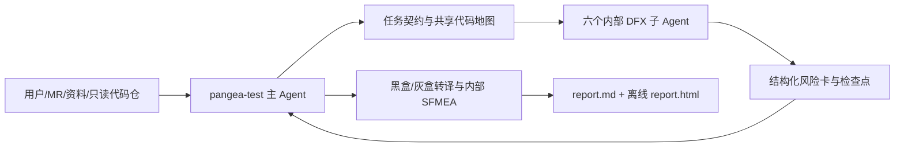

# PANGEA-TEST Architecture v2

> 状态：冻结设计。实现按此文档替换 v1 的三族 Agent 导航架构。

## 1. 设计目标

PANGEA-TEST 将源码证据转化为黑盒测试行动，而不是让用户在测试角色之间切换。用户始终面对一个 `pangea-test` 主 Agent；主 Agent 建立任务契约、统一代码地图、路由内部 DFX 分析、审计风险卡并交付报告。



## 2. 用户入口与状态

用户可使用自然语言，或显式调用 `/initial`、`/setup-tools`、`/mr-regression`、`/module-analysis`、`/resume-run`。自然语言与命令进入相同工作流。

主 Agent 在重要事件发出状态，不把情绪作为判断依据：

| 机器状态 | 中文展示示例 | 触发 |
| --- | --- | --- |
| `mapping` | `梳理中 (._.)` | 识别输入、仓库、版本和任务边界 |
| `analyzing` | `分析中 (｀・ω・´)` | 建立代码地图、流程或影响链 |
| `mining` | `挖掘中 (ง •̀_•́)ง` | 执行 DFX 风险扫描或专项深挖 |
| `reviewing` | `审核中 (¬_¬)` | 合并风险、检查转译质量 |
| `waiting` | `发呆中 (－_－)` | 等待工具或子 Agent |
| `degraded` | `难过中 (；へ：)` | 存在无法闭环的仓库、版本或证据缺口 |
| `escalated` | `狂躁中 (╬ಠ益ಠ)` | 连续工具失败后采取降级路径 |
| `completed` | `高兴中 (￣▽￣)b` | 完成关键因果链或报告交付 |

状态由真实阶段、重要发现、等待、失败和降级触发。同一机器状态的连续通知必须去重，不得制造情绪切换；报告只记事实和结论，不记情绪。

## 3. 工作流

### 3.1 共同前置

1. 发现/导入资料，更新只读仓库并探测工具。
2. 创建任务契约和 Run manifest。
3. 建立最小共享代码地图：模块边界、入口、外部接口、核心状态和已知仓库关系。
4. 根据模式执行工作流；重要材料和阶段产物写入检查点账本。

### 3.2 MR 回归

固定骨架为原场景回归、改动功能验证、影响链回归、异常与恢复验证。主 Agent 从 MR MCP 读取描述、diff、分支、commit；能力不可用时接受用户提供的等价材料。背景不完整时从 diff、commit 和源码反推，并将每个判断标为事实、推断或待确认。

DFX 路由由变更信号决定，例如资源计数、队列、申请/释放路由到资源与规格；锁、原子、回调和销毁路由到并发与异常。MR 不做无证据的资源专项深挖。创建时每个已登记仓必须以 `repository_commits` 绑定 40 位 SHA，且最终只读快照的仓名和 commit 必须精确匹配，不能以旧 commit 替代。

### 3.3 模块全量分析

默认完整型，顺序为：代码地图 -> 关键流程 -> 异常分支 -> 六维 DFX 扫描 -> 命中专项深挖 -> 内部 SFMEA -> 场景和用例。`--fast` 不省略 DFX，只收窄调用链、分支和证据展开。`dfx_scan` 必须恰好有六条 canonical fact，每条含 `dfx`、具体 `conclusion` 与可复核 `evidence`，无风险的维度也必须明确记录。资源规格/泄漏始终轻量扫描，命中资源申请、释放、计数、队列、连接、缓存或内存池等信号后深挖。

通用 mandatory stage（`code_map`、`flow`、`branches`、`impact_chain`、`dfx_route`、`risk_ledger`、`specialist`、`sfmea`、`test_design`）的 completed facts 由 schema 声明 `summary` 与 `evidence`，再由 runtime 拒绝占位、纯标点、单字符或短片段机械重复文本。`mr_baseline` 和 `dfx_scan` 在 checkpoint 写入时校验各自的结构化字段，完整覆盖仍在 workflow 聚合时校验。rework closure 的 evidence 是 `{artifact, location, verification}` 对象；artifact 必须为 Run 相对安全路径，closure 与 verification 必须是不同的具体文本。

## 4. 内部 Agent 编排

六个子 Agent 都是内部工作者，不是用户可选人设：

| 子 Agent | 关注点 |
| --- | --- |
| 功能与状态 | 外部入口、协议/业务状态机、功能边界和分支 |
| 资源与规格 | 配额、队列、内存池、引用/计数、申请释放、过载回落、长稳泄漏 |
| 性能与压力 | 吞吐/时延、队列深度、分配、锁竞争、压力与恢复 |
| 并发与异常 | 共享状态、锁/原子、异步回调、超时取消、初始化/销毁竞态 |
| 升级与兼容 | 版本、配置、持久状态、固件/协议矩阵、回滚 |
| 可靠性与一致性 | 故障注入、恢复、数据完整性、爆炸半径、可用性 |

所有子 Agent加载共享 C/C++ 底座：调用链、状态机、所有权与清理、错误路径、初始化/卸载、C/C++ 边界和白盒到测试语义转译。每个按证据加载专项方法和厂商参考。NVIDIA、Intel、DPDK、RDMA 内容须分为通用方法和厂商实现知识，后者仅在符号、依赖或硬件信息匹配时加载。

子 Agent 不直接写报告，只交扁平的 canonical risk card。`artifact_type`、`schema_version` 与 `risk_id`、`title`、`dfx` 等字段同级，不存在 `risk:` 包裹层；风险账本直接保存这些 canonical risk cards。字段名不使用旧的 `id`、`external_effect` 或 `translation`：

```yaml
artifact_type: risk_card
schema_version: "1.0"
risk_id: risk-...
title: ...
dfx: [资源与规格]
severity: Critical|High|Medium|Low
confidence: low|medium|high
trigger: ...
propagation: ...
external_impact: ...
observation: ...
recovery: ...
translation_status: Blackbox-ready|Graybox-ready|Developer-confirm
instrumentation_request: null
evidence: []
```

主 Agent 合并重复和跨维度风险，保留所有风险，生成内部 SFMEA 和风险-用例多对多映射。`Critical` 适用于数据不一致/丢失、业务归零/断连、需修卡或无法在线恢复等；`High` 适用于核心功能受损、显著性能退化、持续泄漏或高恢复代价；其余按影响范围和规避性归类。

## 5. 证据与测试转译

源码位置、函数、变量、调用链是允许的代码证据，但正式章节先展示测试解释。风险分为：

- `Blackbox-ready`：外部入口、触发、业务判据完整。
- `Graybox-ready`：需要日志、指标、诊断、故障注入或插桩。
- `Developer-confirm`：只有代码疑点，记录在风险账本和证据附录，不伪造可执行用例。

用例字段至少有前置条件、步骤、预期、观测、清理/恢复、关联风险。允许一例覆盖多风险，但不得形成难以定位失败原因的万能用例。

系统级插桩可用于制造异常或时序窗口。插桩需求应包括目标、控制语义、内部控制点/代码位置、参数范围、触发方式、观测、恢复和提供方；Agent 只提出需求，不写插桩代码。禁止生成单测、Mock、替换依赖 Stub 或函数级断言测试。

## 6. 数据与运行时

```text
pangea-data/
  inbox/                         # 用户原始资料
  repositories/                  # 已登记只读仓库
  library/{sources,markdown,assets,catalog.jsonl}  # 有资料后按需创建
  indexes/{records,shadows}      # 有索引任务后按需创建
  runs/<run-id>/                 # 历史 Run 与中间工件
  reports/<run-id>/{report.md,report.html}         # 唯一正式交付
```

`pangea-data/` 是 Git 忽略的运行根。资料转换保留来源锚点和 hash；原件不移动、不改名。`repositories/` 下的单层目录名是正式 Run 的已登记仓名，`--repository` 只能传该名称。new session 增量扫描资料、检查新代码、识别未完成 Run；发现未完成 Run 时展示目标、模式、最后阶段和未完成项，用户选择恢复或新建，不自动混合任务。

### 6.1 独立审计与固定报告模型

主 Agent 在审计前必须调用 `stage-report-v2`，由确定性运行时将完整报告模型原子写入唯一被审文件 `runs/<run-id>/internal/report-model.json`，并返回 SHA-256。报告模型的 canonical `risks` 必须与 `risk-ledger.json` 的 `risk_id` 集合和关键字段逐项一致，审计和完成均会复核。传给隐藏只读 auditor 的绑定固定为 Run 相对路径 `internal/report-model.json` 与该哈希；auditor 只核对绑定和审阅内容，不计算哈希，也不修改 Run。

auditor 只输出 `audit_opinion` 2.0：`artifact_type`、`schema_version`、`audited_artifact`、`audited_sha256`、`verdict`、四维 `checks`（`traceability`、`blackbox_executability`、`coverage`、`format_compliance`）以及 `required_actions`。不使用顶层 `findings` 或 `coverage_gaps`。`PASS` 必须没有 `required_actions`；`CONCERNS` 或 `FAIL` 必须给出可闭环 action。

对非 PASS 意见，主 Agent 按 `required_actions` 数组的 1 起始位置生成整改 payload 的 `action_index`，并用 `record-rework-v2` 写入每项 `closure` 与 `evidence: {artifact, location, verification}`。整改后必须实际重写固定模型、重算哈希并重新审计；下一轮意见的哈希必须不同于上一失败轮，同哈希的 PASS 或再次意见均被拒绝。只有固定模型绑定仍一致的 PASS 意见，才能通过 `finalize-v2 --model <run-dir>/internal/report-model.json` 在 `pangea-data/reports/<run-id>/` 生成正式 `report.md` 和 `report.html`；两个文件实际存在且非空后才算完成。PASS 后模型改变必须重新审计。

代码分析永远只读。仅当仓库干净并可安全快进时执行 `git pull`；认证、分叉、未提交修改或冲突风险一律跳过。MR 特定版本可复制到 `tmp/` 分析，完成后清理。跨仓无法获得时继续现有仓，并将缺口进入报告。机器门禁防止流程遗漏和工件漂移，但不向拥有本机写权限的调用者提供密码学身份认证，也不使用伪 token；独立性来自 `pangea-test` 强制调用隐藏只读 `auditor` 的编排契约。

运行时保存确定性分析账本，压缩时优先保留任务契约、具体数字、事实、源码证据、因果链、高风险、覆盖和未闭环项；抛弃重复和被推翻探索。GitNexus 和静态分析是可选增强，需通过 `/initial` 探测，`/setup-tools` 经用户显式操作才安装或启用；无工具时降级但不停止。GitNexus 只可在 `indexes/shadows/<已登记仓名>/` 的受管 `--no-hardlinks` shadow clone 上运行，源仓始终只读。

## 7. 报告与验收

`pangea-data/reports/<run-id>/` 输出内容一致的 `report.md` 和完全离线单文件 `report.html`；Run 目录只保留历史记录和中间工件。章节顺序为任务契约、代码地图、入口与流程、异常分支、全量风险账本、测试场景、测试用例、覆盖映射、代码证据附录、未闭环与建议。Markdown 保留 Mermaid 源码；HTML 预渲染图并保留文字流程，默认展开测试解释、折叠源码证据，支持搜索、风险筛选和双向跳转。

自动验收使用 SPDK、UCX、RDMA Core、OpenBMC 等公开仓的隐藏缺陷集。除命中已知问题外，评分风险广度、证据正确性、因果链、触发/观测/恢复、严重度和黑盒纯度；同时验证仓库零写入、Git 安全跳过、断点恢复、临时清理和离线 HTML。

## 8. v1 迁移

`dev-expert`、`troubleshooter`、`test-designer` 退役为用户入口，其流程能力下沉为 core skills、方法和工作流步骤。对外可执行工作流只有 `mr-regression` 与 `module-analysis`，并且只创建 `pangea-data/runs/` 下的 v2 Run；`module-full-analysis` 不保留 alias。顶层 CLI 只暴露 v2 数据与工具域，不再分发 `project`、`input`、`asset`、`workflow`；两条工作流由 Agent 命令或 `runctl create-v2` 进入。旧根目录 `source/inputs/workspace/outputs/projects/runs` 已从活动仓库移除；本地遗留内容只检测、不自动移动或删除，也不得从活动 CLI 路径触发旧 `workspace/outputs + runctl init` 协议。保留 `core/`、`runtime/` 的可验证资产并按本契约演进。迁移详情见 [迭代 006](iterations/006-architecture-v2-migration.md)。
